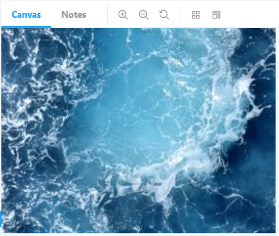
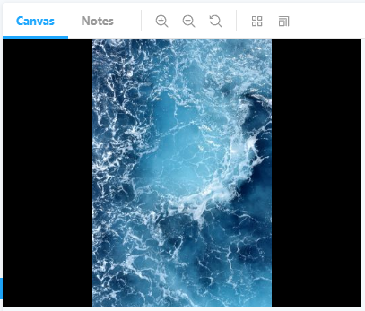

# @zen-web-components/photo-viewer

A photo viewer component for LitElement.

## Features

- Displays image
- Provides multiple content modes
- Provides a way to pan and zoom the photo

## Install

Using `npm`:

```
$ npm install @zen-web-components/photo-viewer
```

Using `yarn`:

```
$ yarn add @zen-web-components/photo-viewer
```

## API

```js
import { IMG_SRC_PORTRAIT } from './_resources'

import { MODE_CONTENT } from '@zen-web-components/photo-viewer'

const ZOOM = 1.5

const PAN_COORDS = {
  x: 16,
  y: 32,
}

```

Cover Mode Usage
```js
const change = src => console.log('viewport src:', src)

... html`
  <zen-photo-viewer
    style="width: 400px; height: 300px;"
    .mode="${MODE_CONTENT.COVER)}"
    .src="${IMG_SRC_PORTRAIT}"
    .zoom="${ZOOM}"
    .panPos="${PAN_COORDS}"
  ></zen-photo-viewer>
`
```



Contain Mode Usage
```js
const change = src => console.log('viewport src:', src)

... html`
  <zen-photo-viewer
    style="width: 400px; height: 300px;"
    .mode="${MODE_CONTENT.COVER)}"
    .src="${IMG_SRC_PORTRAIT}"
    .zoom="${ZOOM}"
    .panPos="${PAN_COORDS}"
  ></zen-photo-viewer>
`
```



Listening for Panning Changes
```js
const change = coords => console.log('coords:', coords)

... html`
  <zen-photo-viewer
    style="width: 400px; height: 300px;"
    .mode="${MODE_CONTENT.COVER)}"
    .src="${IMG_SRC_PORTRAIT}"
    .zoom="${ZOOM}"
    .panPos="${PAN_COORDS}"
    .onChange="${change}"
  ></zen-photo-viewer>
`
```

Capturing the Viewport

The element can report back a base64-encoded string of the viewport's image data when setting the `onCapture()` callback. Due to this being an expensive operation, this only happens whenever new image data is loaded, the viewport mode is changed, or when panning coordinates change.

This feature is completely disabled when no `.onCapture` callback is set.

```js
const capture = src => console.log('viewport src:', src)

... html`
  <zen-photo-viewer
    style="width: 400px; height: 300px;"
    .mode="${MODE_CONTENT.COVER)}"
    .src="${IMG_SRC_PORTRAIT}"
    .zoom="${ZOOM}"
    .panPos="${PAN_COORDS}"
    .onCapture="${capture}"
  ></zen-photo-viewer>
`
```
